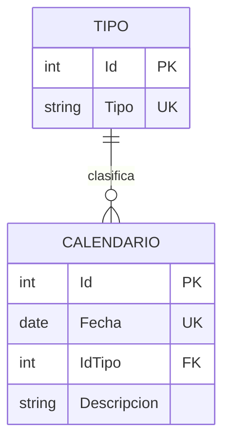

```mermaid
erDiagram
      TIPO  {
        int Id PK
        string Tipo UK
    }

    CALENDARIO  {
        int Id PK
        date Fecha UK
        int IdTipo FK
        string Descripcion
    }

    TIPO ||--o{ CALENDARIO : clasifica 
```