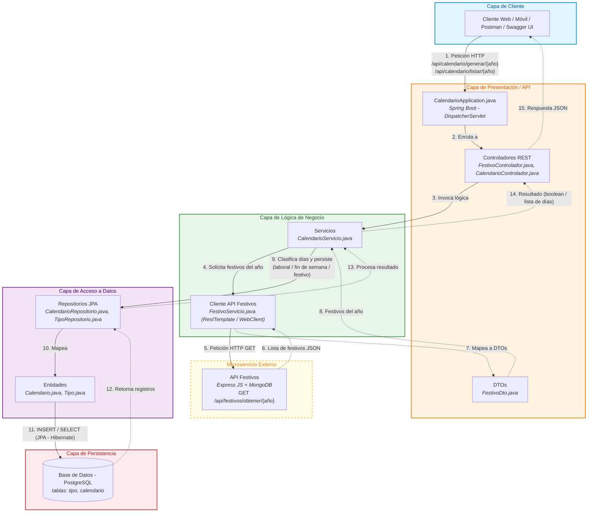

```mermaid
graph TD
    %% Cliente / Capa de Presentación Externa
    subgraph ClientLayer [Capa de Cliente]
        Client["Cliente Web / Móvil / Postman / Swagger UI"]
    end

    %% Capa de Entrada y Enrutamiento (Controladores REST)
    subgraph PresentationLayer [Capa de Presentación / API]
        App["CalendarioApplication.java<br/><i>Spring Boot - DispatcherServlet</i>"]
        Controllers["Controladores REST<br/><i>FestivoControlador.java, CalendarioControlador.java</i>"]
        DTOs["DTOs<br/><i>FestivoDto.java</i>"]
    end

    %% Capa de Lógica de Negocio (Servicios)
    subgraph BusinessLayer [Capa de Lógica de Negocio]
        Services["Servicios<br/><i>CalendarioServicio.java</i>"]
        ClientService["Cliente API Festivos<br/><i>FestivoServicio.java (RestTemplate / WebClient)</i>"]
    end

    %% Capa de Acceso a Datos (Repositorios / Entidades JPA)
    subgraph DataAccessLayer [Capa de Acceso a Datos]
        Repositories["Repositorios JPA<br/><i>CalendarioRepositorio.java, TipoRepositorio.java</i>"]
        Entities["Entidades<br/><i>Calendario.java, Tipo.java</i>"]
    end

    %% Capa de Persistencia
    subgraph PersistenceLayer [Capa de Persistencia]
        DB[("Base de Datos - PostgreSQL<br/><i>tablas: tipo, calendario</i>")]
    end

    %% Microservicio Externo
    subgraph ExternalLayer [Microservicio Externo]
        FestivosAPI["API Festivos<br/><i>Express JS + MongoDB</i><br/>GET /api/festivos/obtener/{año}"]
    end

    %% Flujo de la Petición (Request)
    Client -->|"1. Petición HTTP<br/>/api/calendario/generar/{año}<br/>/api/calendario/listar/{año}"| App
    App -->|"2. Enruta a"| Controllers
    Controllers -->|"3. Invoca lógica"| Services
    Services -->|"4. Solicita festivos del año"| ClientService
    ClientService -->|"5. Petición HTTP GET"| FestivosAPI
    FestivosAPI -.->|"6. Lista de festivos JSON"| ClientService
    ClientService -.->|"7. Mapea a DTOs"| DTOs
    DTOs -.->|"8. Festivos del año"| Services
    Services -->|"9. Clasifica días y persiste<br/>(laboral / fin de semana / festivo)"| Repositories
    Repositories -->|"10. Mapea"| Entities
    Entities -->|"11. INSERT / SELECT (JPA - Hibernate)"| DB

    %% Flujo de la Respuesta (Response)
    DB -.->|"12. Retorna registros"| Repositories
    Repositories -.->|"13. Procesa resultado"| Services
    Services -.->|"14. Resultado (boolean / lista de días)"| Controllers
    Controllers -.->|"15. Respuesta JSON"| Client

    %% Estilos de Nodos
    style ClientLayer fill:#e1f5fe,stroke:#0288d1,stroke-width:2px,color:#01579b
    style PresentationLayer fill:#fff3e0,stroke:#f57c00,stroke-width:2px,color:#e65100
    style BusinessLayer fill:#e8f5e9,stroke:#388e3c,stroke-width:2px,color:#1b5e20
    style DataAccessLayer fill:#f3e5f5,stroke:#7b1fa2,stroke-width:2px,color:#4a0072
    style PersistenceLayer fill:#ffebee,stroke:#d32f2f,stroke-width:2px,color:#b71c1c
    style ExternalLayer fill:#fffde7,stroke:#fbc02d,stroke-width:2px,stroke-dasharray:5 5,color:#f57f17
```
